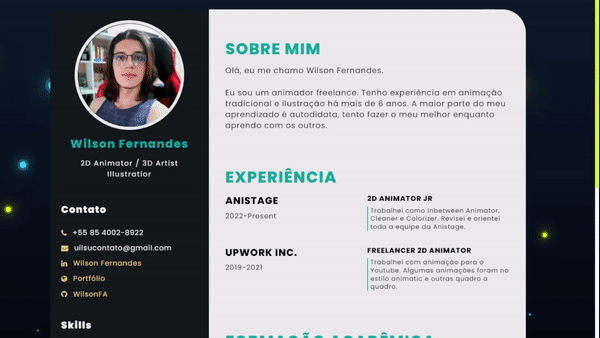

  
<em>EBAC- Escola Britânica de Artes Criativas & Tecnologia</em>

## 😏- My First Front-End Project
<code>
🎯 Construction of a resume page using best web development practices, working with HTML, CSS and GitHub.
</code>

## 🔧Tools used:

## 🚀Journey:
👉**Getting to Know GitHub** 
Learning more about one of the most used technologies on the market.

👉**Introduction of technologies** 
Starting to build my web project.

👉**Creating layouts with HTML** 
Starting my project in HTML.

👉**Digging into HTML** 
Time to practice.

👉**Applying color styles in CSS** 
Learning to style my project using CSS.

👉**GitHub Pages** 
Storing the curriculum on GitHub Pages.

👉**Finalizing the project** 
Last modify.

👉**Closing webinar.**

## ✔️GitHubPages:

  👇**Final Project**

 
  

  
  👉[Click here!](https://wilsonfa.github.io/)

<table>
  <tr>  
    <td align="center">
      <a href="https://github.com/WilsonFA">
         
        
          <b>Wilson Fernandes</b>
        
      </a>
    </td>

